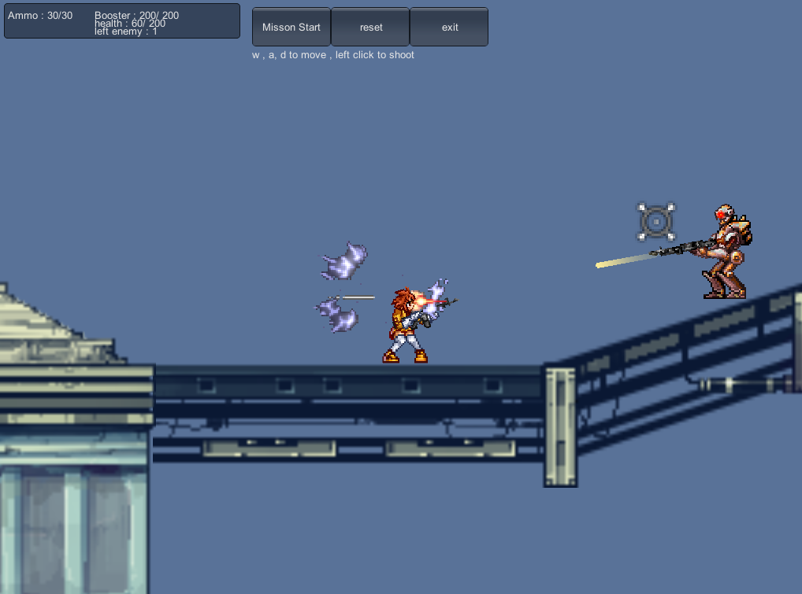
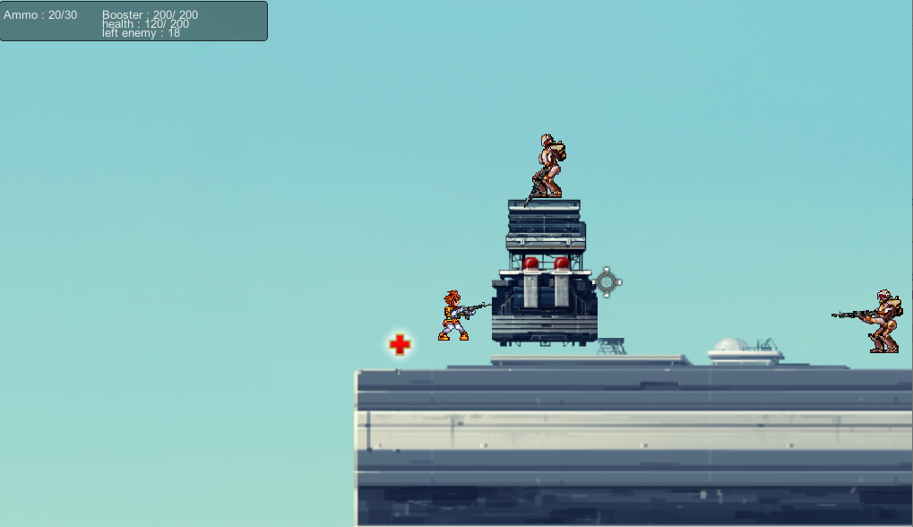
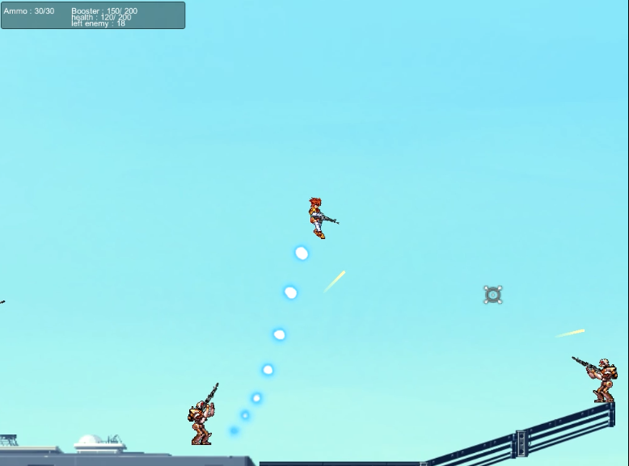
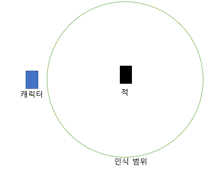
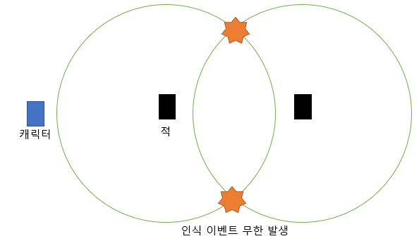
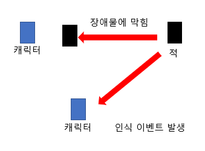
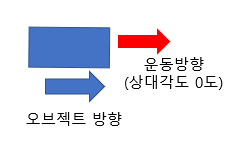
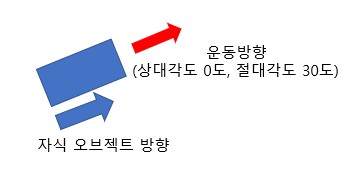
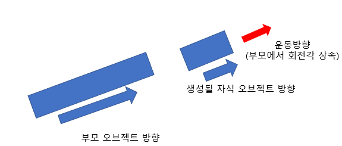
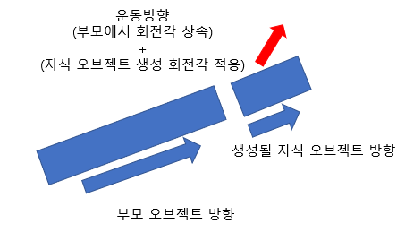

## Wave of Bullets

2015 년 2학년 때 진행. 학교 수업의 연장으로써, 그떄 수업 내에서 만들어봤던 과제물을 좀 더 진행한 후 교내 게임개발 공모전에 제출하여 3등상을 수상하였다.

-----

#### Story?

사실 이게임은 원본이 있다. 2000년대 초기에 한게임에서 서비스했던 Gunster라는 게임인데, 괜찮은 게임성에도 불구하고 홍보, 운영부족, 그리고 soldat이라는 외국 게임과의 유사성 문제로 서비스를 종료하게 되었다. 

그래서 옛날부터 이 게임을 되살리자고 하는 사람들이 많았었고 나도 그중 한명이었는데 , 고등학교 이후로부터 슬슬 기억에서 잊혀져 갔었다. 

그렇게 대학에 와서 유니티 엔진을 배우던 와중에 갑자기 생각이 났다. 과제 내용이 자유롭게 유니티 엔진을 활용한 게임 제작이었는데, 이 게임을 아이디어로 사용하면 좋겠다 싶었던 것.  

게임의 리소스는 한게임에서 공개했던  IDOgame (현재는 서비스 종료함) 의 리소스를 사용했다. 이것저것 다양한 리소스들이 있었는데, 그중에는 건스터의 리소스도 있어서 그대로 사용할 수 있었다.

사실 공모전 이전에 기간이 좀 더 많았더라면 미션도 추가하고, 멀티플레이 기능도 넣어보고, 좀 더 다양한 기믹을 추가하고 싶었는데 당시 군입대를 목전에 둔 시기였고 , 다른공부를 좀 더 해보고 싶어서 여기까지만 하고 멈췄다. 

----

#### 상세

장르는 2d 횡스크롤 슈팅으로써, 맵 내에 위치한 모든 적을 처치하면 미션이 클리어되고, 적에게 너무 많이 맞아 hp가 0이 되면 미션 실패다. 

진행 중간중간 체력 회복 아이템이 있어서 이를 가지고 체력을 회복할 수도 있다.

부스터 게이지와 잔탄량이 있어 교전중에 재장전과 부스터에 신경을 써야한다. 

 튜토리얼도 있고, 피격모션과 이펙트, 걷는 소리같은것도 구현되어있었다. 

---

#### 개발 당시 문제점과 해결

1. **2D 스프라이트 ** 

   사실 개발할때 코딩 외적으로 제일 어려웠던건 2d 스프라이트를 가지고 애니메이션을 만들어서 그림에 활기를 넣어주는 과정이었다. 캐릭터는 몸과 머리, 팔, 다리로 분리되어서 움직여야 하는데, 팔과 머리는 마우스 위치에 따라서 돌아가야 했고 , 다리는 조작에 따라서 다른 애니메이션을 출력했어야 한다.  그리고 그렇게 만든 애니메이션은 각 파츠별로 코드를 작성하여 하나로 합치는 과정을 거쳤다. 

2. **적의 캐릭터 인식범위**

   그 다음으로 어려웠던것이 , 적이 캐릭터를 인식하고 공격하게 하려면 어떻게 해야하는지? 였었다.  

   처음에는 적 하나하나 별로 캐릭터와의 거리를 측정하여 일정 거리 내로 들어오면 인식하고 공격하게 하는것이었는데, 구현 방식에서 문제가 발생했다. 

   

   적 캐릭터별로 일정 크기를 가지는 투명한 원을 생성하여 그 원에 플레이어가 들어온다면 공격하는 방식이었는다. 그러나 장애물이 있는 경우에도 공격하는 현상과, 적 끼리 원이 겹치는 경우에 인식 이벤트가 무한히 발생하여 게임이 터져버리는 문제가 발생하여 다른 방식을 찾아야 했다. 

   

   유니티에서는 raycast라는 함수를 사용할 수 있는데,  대상과 대상 사이에 보이지 않는 광선을 발사하여 각종 정보를 주고받게 하는 함수이다. 이를 이용해 캐릭터와 적 사이에 장애물이 있는지 없는지를 체크할 수 있어서 일정 거리내로 들어오고, 그 안에 장애물이 있는지 없는지를 체크해 공격하게끔 , 일종의 규칙을 만들어 준 셈이다. 

   

3. **발사된 총알 투사체** 

   이게 개발 당시에 가장 어려웠던 문제점이다. 유니티에서는 각 물체를 오브젝트와 그 위에 덧붙여질 텍스쳐 두가지로 구분하는데, 이 오브젝트와 텍스쳐 각각에 대해 위치/회전 속성값을 별도로 부여할 수 있다. 

   총알이 발사되는 규칙은 캐릭터로부터 마우스 커서 방향으로 발사되는데,  여기서부터 골머리를 앓기 시작한다.

   1. 생성된 오브젝트의 방향과 운동량의 방향은 별개가 아님

      무슨 소리냐면, 오브젝트가  ㅡ> 모양으로 존재하더라도 운동방향은 위쪽방향이나 대각선으로 움직일 수 있고, 오브젝트의 모양은 그에 영향을 받지 않는다. 운동방향은 오브젝트의 회전각을 상속하기에 오브젝트를 돌리면 운동 방향이 같이 돌아간다.

      

      근데 여기서 오브젝트가 우측 0도 방향으로 움직이게 해뒀는데 오브젝트가 30도 방향으로 회전했다고 하면 **회전한 상태에서** 상대각도 0도, 정면으로 움직인다. 즉, 오브젝트가 바라보는 방향으로 움직인다는 이야기. 

      

   2. 특정 오브젝트에 상속되는 새로운 오브젝트를 생성할 때 새 오브젝트는 부모 오브젝트의 방향을 상속한다. 

      

      이걸 몰라서 엄청 오랫동안 삽질을 거듭했다. 새로 생성될 총알 오브젝트가 팔이나 머리를 기준으로 하여 생성되게 되면 팔/머리의 **회전 각도를 그대로 상속**하여 생성되기 때문에 내가 원하는 방향을 바라보고 있지 않는 식이었고, 몸통을 기준으로 하여 생성되면 같은방향만 계속 바라보게 되는 현상이 발생한다. 
   
      위 그림을 예시로 들면, 부모 오브젝트가 우측 30도 방향을 보고있으면 자식 오브젝트 생성시에도 해당 방향을 그대로 바라보게 되고, 상대각도 우측 0도인 운동방향은 절대각도 우측 30도로 변환된다. 
   
      이는 새로운 오브젝트가 기준이 되는 오브젝트를 상속하지 않게끔 하는 식으로 해결했다. 
   
   3. 1+2가 합쳐지면..? 
   
      저 두가지 문제점이 합쳐져서 최종적인 문제가 발생했는데, 최초에 코드 작성시 총알 오브젝트가 발사되는 회전 방향은 캐릭터가 바라보는 만큼 추가적으로 회전이 적용되게 만들었다. 
   
      
   
      그런데 캐릭터 오브젝트를 기준으로 총알 오브젝트를 생성하여 발사하게 되면 총알이 캐릭터 오브젝트의 방향을 상속한 채로 날아가므로, 회전이 중첩되서 작용되기 때문에 절대로 내가 원하는 모양대로 화면에 보여지지가 않았다. 위 그림을 예시로 들면, 오른쪽으로 30도 만큼 기울어진 상태로 60도 방향으로 날아가는 셈. 심지어 발사한 상태에서 몸을 회전시키면 총알이 **날아가는 도중에** 방향이 바뀌어버리더라. 
   
   결국 이는 2번의 해결법인 새 오브젝트가 캐릭터로부터 상속이 되지 않게끔 별도의 코드를 작성하고, 생성된 오브젝트에만 회전값과 방향을 부여하는 식으로 해결했다. 개연성 없는 상속 관계가 어떤식으로 작용하는지를 절실히 깨달았다 . 

---

#### 정리 

이 프로젝트로 그동안 해보고 싶었던 게임엔진/개발 공부를 확실히 해볼 수 있었고, C# 프로그래밍도 어느정도 익혔으며 처음으로 객체지향 프로그래밍을 제대로 다뤄본것 같다.  

유니티엔진을 비롯하여 게임에서 다루는 게임 내 객체들은 객체 하나로써만 존재하는게 아니고, 객체와 그 객체에 상속되는 자식 객체 , 컴포넌트들로 구성 된다는것을 이때 처음 알았다. 객체지향 프로그램이 실제로 활용될 때 어떤식으로 쓰이는지에 대해 직접적으로 알게 된 셈. 

이때 다른 게임 엔진도 다뤄보고 싶다는 생각이 들게 되어, 이 프로젝트가 이후에 게임메이커 스튜디오, 언리얼 엔진등을 공부하게 되는 계기가 되었다. 

