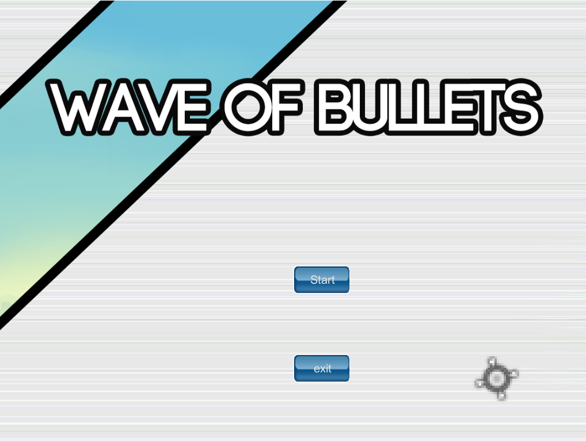

## Wave of Bullet

2015 년 2학년 때 진행. 학교 수업의 연장으로 , 만들어봤던 과제물을 좀 더 진행해서 교내 게임개발 공모전에 제출함.  굉장히 저열한 퀄리티였음에도 불구하고 3등 수상.

이게 되더라. 

#### Story?

사실 이놈은 원본이 있다. 2000년대 초기에 한게임에서 서비스했던 Gunster라는 게임인데, 나름 재밌는 게임성에도 불구하고 홍보, 운영부족, 그리고 soldat과의 유사성 문제로 서비스를 종료하게 되었다. 

그래서 옛날부터 이 게임을 되살리자고 하는 사람들이 많았었고 나도 그중 한명이었는데 , 고등학교 이후로부터 슬슬 기억에서 잊혀져 갔었다. 

그렇게 대학에 와서 유니티 엔진을 배우던 와중에 갑자기 생각이 났다. 과제 내용이 자유롭게 유니티 엔진을 활용한 게임 제작이었는데, 그 게임을 아이디어로 사용하면 좋겠다 싶었던 것.  

게임의 리소스는 한게임에서 공개했던  IDOgame의 리소스를 사용했다. 이것저것 다양한 리소스들이 있었는데, 그중에는 건스터의 리소스도 있어서 그대로 사용할 수 있었다.

사실 공모전 이전에 기간이 좀 더 많았더라면 미션도 추가하고, 멀티플레이 기능도 넣어보고, 좀 더 다양한 기믹을 추가하고 싶었는데 당시 군입대를 목전에 둔 시기였고 , 다른공부를 좀 더 해보고 싶어서 여기까지만 하고 멈췄다. 

#### 상세

장르는 2d 횡스크롤 슈팅으로써, 맵 내에 위치한 모든 적을 처치하면 미션이 클리어되고, 적에게 너무 많이 맞아 hp가 0이 되면 미션 실패다. 

진행 중간중간 체력 회복 아이템이 있어서 이를 가지고 체력을 회복할 수도 있다.

부스터 게이지와 잔탄량이 있어 교전중에 재장전과 부스터에 신경을 써야한다. 

나름 튜토리얼도 있고, 피격모션과 이펙트, 걷는 소리같은것도 구현되어있었다. 

#### 개발 당시 문제점

1. **2D 스프라이트 ** 

   사실 개발할때 코딩 외적으로 제일 어려웠던건 2d 스프라이트를 가지고 애니메이션을 만들어서 그림에 활기를 넣어주는 과정이었다. 캐릭터는 몸과 머리, 팔, 다리로 분리되어서 움직여야 하는데, 팔과 머리는 마우스 위치에 따라서 돌아가야 했고 , 다리는 조작에 따라서 다른 애니메이션을 출력했어야 한다. 

2. **인식범위**

   그 다음으로 어려웠던것이 , 적이 캐릭터를 인식하고 공격하게 하려면 어떻게 해야하는지? 였었다.  

   처음에는 적 하나하나 별로 캐릭터와의 거리를 측정하여 일정 거리 내로 들어오면 인식하고 공격하게 하는것이었는데, 장애물이 있는 경우에도 공격하는 현상이 발생해서 다른 방안을 찾았어야 했다. 

   유니티에서는 raycast라는놈을 사용할 수 있는데,  대상과 대상 사이에 보이지 않는 광선을 발사하여 각종 정보를 주고받게 하는 함수이다. 이를 이용해 캐릭터와 적 사이에 장애물이 있는지 없는지를 체크할 수 있어서 일정 거리내로 들어오고, 그 안에 장애물이 있는지 없는지를 체크해 공격하게끔 , 일종의 규칙을 만들어 준 셈이다. 

3. **발사된 총알 투사체** 

   이게 개발 당시에 가장 어려웠던 문제점이다. 유니티에서는 각 물체를 오브젝트와 그 위에 덧붙여질 텍스쳐 두가지로 구분하는데, 이 오브젝트와 텍스쳐 각각에 대해 위치/회전 속성값을 별도로 부여할 수 있다. 

   총알이 발사되는 규칙은 캐릭터로부터 마우스 커서 방향으로 발사되는데,  여기서부터 골머리를 앓기 시작한다.

   1. 생성된 오브젝트의 방향과 운동량의 방향, 오브젝트에 부여된 텍스쳐의 방향은 별개가 아님

      무슨 소리냐면, 오브젝트가  ㅡ> 모양으로 존재하더라도 운동방향은 위쪽방향이나 대각선으로 움직일 수 있고, 오브젝트의 모양은 그에 영향을 받지 않는 다는 것이고, 텍스쳐는 오브젝트의 회전각을 상속하기에 오브젝트를 돌리면 텍스쳐가 같이 돌아가고, 텍스쳐만 돌리면 오브젝트는 돌아가지 않는다.  근데 여기서 오브젝트가 위쪽 방향으로 움직이게 해뒀는데 오브젝트가 오른쪽으로 회전했다고 하면 **오른쪽으로 회전한 상태에서** 자기 기준으로 위쪽으로 움직인다. 즉, 오른쪽으로 날라간다는 소리다.  

   2. 특정 오브젝트를 기준으로 새로운 오브젝트를 생성할 때 새 오브젝트는 이전 오브젝트의 방향을 상속한다. 

      이걸 몰라서 엄청 오랫동안 삽질을 거듭했다. 새로 생성될 총알 오브젝트가 팔이나 머리를 기준으로 하여 생성되게 되면 팔/머리의 **회전 각도를 그대로 상속**하여 생성되기 때문에 내가 원하는 방향을 바라보고 있지 않는 식이었고, 몸통을 기준으로 하여 생성되면 같은방향만 계속 바라보게 되는 현상이 발생한다. 심지어 발사한 상태에서 몸을 회전시키면 총알이 **날아가는 도중에** 방향이 바뀌어버리더라. 

      이는 새로운 오브젝트가 기준이 되는 오브젝트를 상속하지 않게끔 하는 식으로 해결했다. 

   3. 1+2가 합쳐지면..? 

      저 두가지 문제점이 합쳐져서 최종적인 문제가 발생했는데, 캐릭터 오브젝트를 기준으로 총알 오브젝트를 생성하여 발사하게 되면 총알이 캐릭터 오브젝트의 방향을 상속한 채로 날아가는데다가 오브젝트와 텍스쳐의 방향이 각각 별개로 작용하고, 회전이 중첩되서 작용하는데 회전한 방향을 기준으로 운동하는 등 절대로 내가 원하는 모양대로 화면에 보여지지가 않았다. 

   결국 이는 2번의 해결법인 새 오브젝트가 캐릭터로부터 상속이 되지 않게끔 별도의 코드를 작성하고, 생성된 오브젝트의 텍스쳐가 아닌 오브젝트에만 회전값과 방향을 부여하는 식으로 해결했다. 개연성 없는 상속 관계가 어떤식으로 끔찍하게 작용하는지를 절실히 깨달았다 . 

#### 정리 

어찌됐든, 이 프로젝트로 그동안 해보고 싶었던 게임엔진 공부를 확실히 해볼 수 있었고, C# 프로그래밍도 어느정도 익혔으며 처음으로 객체지향 프로그래밍을 제대로 다뤄본 계기가 되었다. 

확실히 흥미있는 주제에 대해 공부하면 그만큼 집중도도 올라가고 효율도 좋고, 나중에 기억에 남는것도 많은것 같다. 물론 결과도 좋았고 말이다. 

